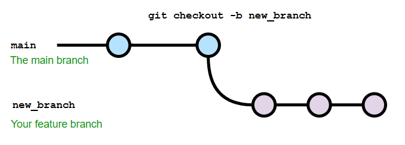
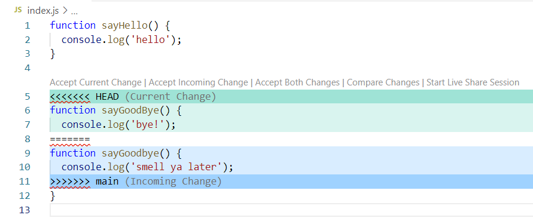

# Git branching

## Prior Knowledge

- Be able to make `git` commits to a single branch
- Be able to `push` and `pull` commit histories from a `git remote`

## Learning Objectives

- Understand how to create new `git` branches
- Understand how to merge branches via Github Pull Requests

When working of software projects a very useful feature is to be able to separate our concerns and work on different tasks in isolation.

Git provides this functionality via `branches`. Each branch maintains it's own version of the code and can be worked on independently without affecting the code on other branches.

Developers can work on their own branches and merge branches together at a point of their choosing which is very useful for collaboration.

A git repo will have a default branch. This will typically be named `main` when creating new repos with services such as Github but was traditionally called `master` in the past but this is a convention and you can use and branch you want as the default.

Below are some useful git commands related to branching

- `git branch` - list local branches (current branch is marked by `*`)
- `git checkout -b <new_branch_name>` - create a new branch from the current branch
- `git checkout <branch_name>` - change to an existing branch by name
- `git branch -D <branch_name>` - delete a local branch by name
- `git push origin <branch_name>` - push to the `origin` remote at the named branch (Creates the branch if it doesn't already exist)

When working on a git repo you can check the name of the branch you are currently working on by using the `git branch` command. This will show all local branches and the currently selected branch.

To create a new branch use the command `git checkout -b <new_branch_name>`. This will create a new branch from the current commit so you will have all of the same code on the new branch as the one you branched from. (New branches will typically be made from the default branch.)



You can continue to work on this branch and make commits in the usual manner. When running `git commit` the commit is made to the current branch.

## Github Pull Requests (PR's)

When The work on a branch has been completed branches can be `merged` together. Whilst branches can be merged locally with git the workflow we will use is a `Github Pull Request`.

Once the code on a feature branch is complete, committed and pushed to Github a new PR (Pull Request) can be opened from the tab on Github.

Select the branch you want to merge into the default branch on open the PR.


The PR will stay open to allow others (or yourself) to review the changes, leave comments or feedback and merge in the changes when you are ready.

**nb** Github has 3 options when merging a PR. We will use `Create a merge commit`

You can have multiple pull requests open at the same time.

**important** If you are going to continue working whilst leaving a PR open (whilst waiting for a code review, for example) make sure that you switch back to the main branch before making a new one. Don't branch of from the current feature branch.

```bash
git checkout main
git checkout -b new_feature
```

One a PR is merged into the main branch on github don't forget to pull down those changes to your local version.

```bash
git pull origin main
```

## Troubleshooting Merge conflicts

When working on multiple branches we endeavour as much as possible to split up our work and to have branches be dedicated to separate features. This prevents our branches from having conflicting changes but in the real world things don't always go that smoothly and different branches will change the same lines of code to different things.

Git works by tracking changes to files and when it comes to merging branches together and lines touched in different ways will generate a `merge conflict`.

This is not necessarily a bad thing and could be caused by 2 dev's adding different functions to the end of the same file and we, as developers need to tell git how to resolve these conflicts and what the final code should look like. This could be either, both, neither or a combination of the 2 versions.

If github can't merge your PR because of conflicts then follow the following steps to resolve them. (These steps assume you are merging a branch called `feature` into `main`.)

1. Update the local versions of your code.

```bash
$ git checkout main
$ git pull origin main
$ git checkout feature
$ git pull origin feature
```

2. Merge the local `main` branch into `feature`

```bash
git merge main
```

The conflicting versions will be added to the files to show you both versions and allow you to resolve the conflict. VSCode will do some highlighting of the conflicts and add some links for common options such as `Accept Current Change`.



Use one of these options or resolve the conflict manually. Once you are satisfied with the final version of the code make sure you've saved the changes then add and commit the files with git.

Now the conflicts are resolved push the changes up to Github and the PR should be able to be merged.
